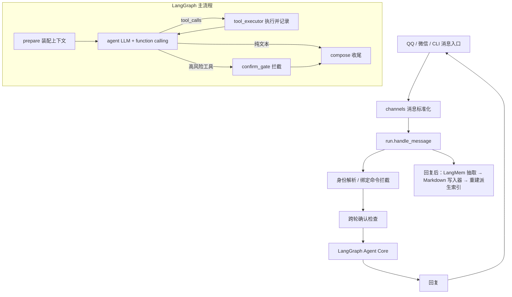

# 小青团 架构说明

本文介绍小青团的整体结构：它是什么、由哪些模块组成、数据如何流动、记忆与工具系统怎么工作、如何部署。
面向想了解项目设计或参与开发的人，配合代码阅读。操作与部署步骤见 `README.md`。

## 1. 项目定位

小青团是一个面向 QQ / 微信聊天场景的**个人任务型 LLM Agent 助手**，不是单纯的聊天机器人。

核心能力：多轮对话、工具调用（function calling）、长期记忆、Hybrid RAG、结构化 Wiki 记忆、
多用户身份与跨渠道绑定、人工确认、操作审计、可重建索引。

底层消息框架（NoneBot2、OneBot V11、WxClaw）只是**接入层**，Agent Core 与它们解耦——
换 IM 平台不影响核心逻辑。

## 2. 总体架构



设计原则：

- **统一为纯 function calling**：意图判断与工具选择全部交给 LLM，没有启发式路由层。
  对话与任务执行是同一个工具循环的两个分支（出文本 = 闲聊，出 `tool_calls` = 调工具）。
- **原始事件日志（events）是流水真源**：只追加、不覆盖、不删除。
- **Markdown Wiki 是长期知识的唯一权威源**：人可直接读、改、审计。
- **派生层（memories / FTS5 / LanceDB / relations）从 Wiki 单向派生**，损坏可重建。
- **真实操作前必须人工确认**：高风险工具被 `confirm_gate` 拦截。
- **记忆更新不静默覆盖旧事实**：last-write-wins + 旧值进历史保留。

## 3. 技术选型

| 模块 | 技术 | 作用 |
|---|---|---|
| Agent 编排 | LangGraph | 工具循环、人工确认、状态流转 |
| LLM | DeepSeek `deepseek-v4-flash` | 对话、function calling、记忆抽取、结果总结 |
| 记忆抽取 | LangMem 思路（仅抽取） | 对话/工具结果 → 结构化候选；存储与检索自研 |
| 长期知识 | Markdown Wiki | 稳定事实、偏好、规则、记录（唯一权威源） |
| 原始日志 | SQLite | 对话、工具调用、预约、失败原因（只追加） |
| 全文检索 | SQLite FTS5（trigram/BM25） | 关键词、实体名、日期、文件名 |
| 语义检索 | LanceDB + 本地 `bge-small-zh-v1.5`（512 维） | 向量召回、hybrid search；CPU 可跑、免 GPU |
| 网页搜索 | Tavily（免费 1000/月）/ mock | function calling 接入；无 key 时降级 mock |
| 工具扩展 | MCP 客户端 | 接入任意外部 MCP server，工具并入注册表 |
| 自动化操作 | Playwright（预留） | 图书馆座位预约（未实现，仅留 provider 接口） |
| 部署 | Docker Compose | pmhq + llbot + agent 三容器一键拉起 |

## 4. 模块结构（代码映射）

```text
bot.py                 NoneBot 启动 + 注册渠道 + MCP 启停钩子
src/
  channels/            渠道网关：标准化进出消息
    base.py            InboundMessage / OutboundMessage
    qq.py wechat.py    OneBot V11 / WxClaw 适配
    cli.py             本地终端对话（开发调试）
  agent/               Agent Core
    run.py             对外入口：流水 + 身份 + 确认 + 跑图 + 抽取记忆
    graph.py           LangGraph：prepare → agent ⇄ tool_executor，confirm_gate
    prompts.py         系统提示（工具清单从注册表动态渲染）
    confirmation.py    跨轮人工确认（pending 区 + 肯定/否定识别）
    state.py llm.py    图状态、DeepSeek 客户端（工具绑定缓存）
  tools/               工具层
    registry.py        Tool / ToolRegistry，high_risk 标记，function-calling schema
    wiki_search.py     查询长期记忆 / Wiki（hybrid 检索）
    note_write.py      写入长期记忆
    web_search.py      联网搜索（Tavily / mock）
    library_seat.py    图书馆 LibraryProvider 抽象 + Mock，get_provider() 切后端
    reservation_history.py  查询历史预约
    mcp_bridge.py      MCP 客户端桥接：接入外部 MCP server 的工具
  memory/              记忆系统（工程量最大）
    wiki.py            frontmatter + 当前/历史段解析与原子写回
    chunker.py         按标题 + 段切片
    fts.py vector.py   FTS5（BM25）/ LanceDB（bge-small，惰性加载 + 优雅降级）
    store.py           单文件派生层幂等重建
    writer.py          last-write-wins + hash 校验 + pending 队列
    langmem_adapter.py 记忆抽取（DeepSeek 结构化）
    search.py          Hybrid 融合检索（结构化 + FTS5 + 向量，带来源）
    reindex.py         python -m src.memory.reindex 全量重建
  identity/            多用户身份
    store.py           person / account 解析、跨渠道绑定合并
    commands.py        聊天内绑定 / 确认 / whoami 命令
  storage/
    db.py              SQLite 7 张表 + 流水写入 / 派生重建辅助
  config.py            路径与运行时配置（环境变量覆盖）
wiki/                  Markdown Wiki：长期知识唯一权威源
```

## 5. 数据流与存储

两个真源域互不混淆：

| 域 | 真源 | 存储 | 可变性 |
|---|---|---|---|
| 原始流水：消息、工具调用、工具结果、预约状态、确认 | events / tool_calls / reservations | SQLite | 只追加 |
| 沉淀知识：画像、偏好、规则、记录 | **Markdown Wiki** | `wiki/*.md` | 人或 agent 编辑（走写入器） |
| 检索索引 | memories / relations / wiki_chunks / wiki_fts / LanceDB | SQLite + LanceDB | 派生，可重建 |

events 记"发生过什么"；Wiki 记"现在确信什么"。不把对话原文写进 Wiki，也不把 Wiki 事实塞进 events。

### SQLite 表（`src/storage/db.py`）

流水真源（只追加）：

```sql
events       (id, session_id, user_id, role, content, event_type, created_at, metadata)
tool_calls   (id, event_id, tool_name, arguments, result, status, error, created_at)
reservations (id, library, area, seat, date, start_time, end_time, status, source_event_id, created_at, metadata)
```

- `event_type`：`user_message` / `assistant_message` / `tool_call` / `tool_result` / `memory_update` / `confirmation_request` / `confirmation_result`。
- `tool_calls.status`：`planned` / `waiting_confirmation` / `success` / `failed` / `cancelled`。

派生索引（从 Wiki 重建）：

```sql
memories     (id, subject, predicate, value, memory_type, confidence, status, source_event_id, valid_from, valid_to, updated_at)
relations    (id, subject, predicate, object, confidence, status, source_event_id, valid_from, valid_to)
wiki_chunks  (chunk_id, doc_id, path, title, section, content, content_hash, updated_at, metadata)
wiki_fts     FTS5(chunk_id, title, section, content, tokenize='trigram')
```

- `memories.memory_type`：`semantic` / `episodic` / `procedural` / `preference` / `task_state`；`status`：`active` / `expired`。
- `relations` 目前仅建表留接口，尚未从 Wiki 抽取三元组。
- 派生数据都在 `data/`（gitignore），任何时候可 `python -m src.memory.reindex` 从 `wiki/` 全量重建。

## 6. 记忆系统

### 核心原则

**Markdown Wiki 是长期知识的唯一权威源；其余索引全部从 Wiki 单向派生。**
长期事实进入系统的唯一入口是"写一段 markdown"，然后重建相关索引。
好处：索引损坏可从 `wiki/` 完整重建；用 git 管 `wiki/` 即得记忆的版本历史、审计与回滚。

### Wiki 文件模板

一主题一文件，每个文件含 frontmatter + `## 当前` + `## 历史`（解析器与写入器都依赖该模板）：

```md
---
id: library_preference
type: preference            # preference | semantic | procedural | profile | record
confidence: 0.9
source: conversation:2026-06-23
updated_at: 2026-06-23
---

# 图书馆偏好

## 当前               # active facts，进入默认检索
- 优先二楼安静区
- 提交预约前必须二次确认

## 历史               # expired facts，带时间区间，默认不参与决策、可查史
- 2026-06-20~2026-06-23：曾偏好三楼靠窗（太吵，已弃用）
```

### 写入流程

```text
对话 / 工具结果
  → LangMem 抽取候选 {type, subject, predicate, value, confidence}
  → 写入器按 type/subject 映射到目标 .md
  → 读文件计算 hash；改内存里的「当前/历史」段：
        · 新事实 append 到 ## 当前
        · 冲突（同 subject+predicate）：last-write-wins —— 旧值移 ## 历史 标 valid_to，新值入 ## 当前
  → 写回前再校验 hash：未变则原子写回；被人工改过则候选入 pending 队列，不覆盖
  → 重新解析该文件 → 重建其 wiki_chunks / memories / FTS5 / LanceDB
  → events 记一条 memory_update
```

冲突策略：last-write-wins + expire 保留历史。来源优先级仲裁、完整冲突引擎留作后续增量。

### 读取流程（Hybrid 检索）

记忆不再每轮预取，而是 LLM 按需调用 `wiki_search` 工具触发：

```text
结构化查 memories（按 subject/predicate，仅 status=active）
  + FTS5 BM25 关键词召回（实体名/术语/日期）
  + LanceDB 向量召回（换种说法的语义匹配）
  → 融合：合并 top-k、按 chunk 去重、按新鲜度加权
  → 带来源（文件 path + section）返回
```

缺 embedding 依赖时向量层优雅降级，仅用 FTS5，其余功能不受影响。

## 7. 工具与 function calling

每个工具（`src/tools/registry.py`）带：`name` / `description` / 参数 schema / `func` 执行体 / `high_risk` 标记 / `source`。
注册表统一生成 DeepSeek function-calling schema，并供 `prompts.py` 动态渲染工具清单——
新增工具或接入 MCP 后，系统提示自动同步，无需手改。

内置工具：

| 工具 | 作用 | 高风险 |
|---|---|---|
| `wiki_search` | 查询长期记忆 / Wiki | 否 |
| `note_write` | 记录偏好 / 事项 / 笔记 | 否 |
| `web_search` | 联网搜索（Tavily/mock） | 否 |
| `library_seat_query` | 查询图书馆空座（mock） | 否 |
| `library_reservation_create` | 提交图书馆预约（mock） | 是 |
| `reservation_history` | 查询历史预约 | 否 |

高风险工具（提交/取消预约、发消息、改重要配置等）在执行前被 `confirm_gate` 拦截，
产出确认请求，由 `confirmation.py` 跨轮等待用户回复『确认』/『取消』。

### MCP 扩展（`src/tools/mcp_bridge.py`）

小青团是 **MCP 客户端**：把任意外部 MCP server 的工具适配成本地 `Tool` 并入注册表，
LangGraph 循环零改动调用。支持 `stdio` / `sse` / `streamable-http` 三种传输，连接进程级保活。
通过 `XQT_MCP_CONFIG`（JSON）声明 server，启动时 `init_mcp_from_config` 自动接入（接入步骤见 README）。

安全边界：远程工具的**高风险等级由本地白名单决定**，不信任 server 自报；注册后仍走 `confirm_gate`。
工具来源标 `mcp:<server>` 便于排查。参数校验交给 server 端，结果统一归一化为 dict。

未来可把**图书馆预约**这类重而脆弱的能力（Playwright / 登录态 / 验证码）拆成独立 MCP server：
`library_seat.py` 的 `get_provider()` 按 `XQT_LIBRARY_PROVIDER`（`mock` | `mcp` | `playwright`）切后端，
Agent 主流程零改动。

## 8. 多用户身份与跨渠道绑定

QQ / 微信可能有多个用户，且微信用户与 QQ 用户可能是同一人。`src/identity` 用一层身份把"人"与"账号"分开：

- **person**：稳定的人标识（`p`+10 位 hex）。长期记忆按它分区。
- **account**：`(channel, account_id)`，如 `(qq, 123456)`；首次见到自动建 person。
- **绑定**：聊天内「绑定 + 验证码」把两个账号关联成同一 person，合并记忆。

记忆分区：个人记忆写到 `wiki/users/<person_id>/...`；非 `users/` 路径是全员共享知识。
检索时某 person 只看见自己的 `users/<pid>/` + 共享路径，用户间互不串味。

## 9. 部署拓扑

```text
docker-compose（共享网络 xqt_net）
├── pmhq          linyuchen/pmhq      无头 QQ 协议端，:13000，扫码登录
├── llbot         linyuchen/llbot     LuckyLilliaBot：OneBot V11 + WebUI :3080
│                   └─ OB11 ws-reverse 客户端 ──> xiaoqingtuan:8080
└── xiaoqingtuan  (本仓库镜像)        NoneBot + LangGraph Agent，OB11 反向 WS 服务端 :8080
                     └─ 出站 HTTP 直连 DeepSeek / WxClaw / Tavily / MCP server
volumes: qq_volume(QQ 登录态) · xqt_data(sqlite+lancedb+hf 缓存) · ./wiki(bind，权威记忆源)
```

QQ 后端作为 OneBot V11 反向 WS 客户端主动连 agent 的 WS 服务端；容器化 llbot 与宿主机桌面版二选一
（同一 QQ 不能两处登录）。微信走出站 HTTP 长轮询，不需开放端口。具体步骤见 README。

## 10. 现状与未来

已落地：渠道网关、统一 function-calling 的 Agent Core、工具注册与人工确认、Wiki-first 长期记忆
（解析/写入/Hybrid 检索/reindex）、多用户身份与跨渠道绑定、MCP 客户端接入、Docker 全栈部署、CLI 端到端跑通。

待完善：

- 图书馆真实预约（Playwright 或独立 MCP server）；目前仅 mock provider + 接口预留。
- `relations` 三元组抽取（已建表，未实现抽取器）。
- pending 队列重放（hash 撞车的候选目前只落盘未消费）。
- 记忆抽取去重（纯查询可能重复记录已知偏好）。
- 中文 FTS 召回（trigram 一般，可加 jieba 分词字段）。
- 工程化评测：工具成功率、检索命中率、任务完成率、延迟、token 成本。

## 11. 关键边界

避免：把项目做成纯聊天机器人；过度强调底层 IM 框架；把长期记忆做成纯向量库；
让 LLM 静默覆盖旧记忆；实现绕验证码 / 抢座 / 规避限制。

真正卖点：任务型 Agent + 长期记忆 + Hybrid RAG + 工具调用（含 MCP 扩展）+ 人工确认 +
可追溯日志 + 多用户隔离 + 真实个人工作流落地。
